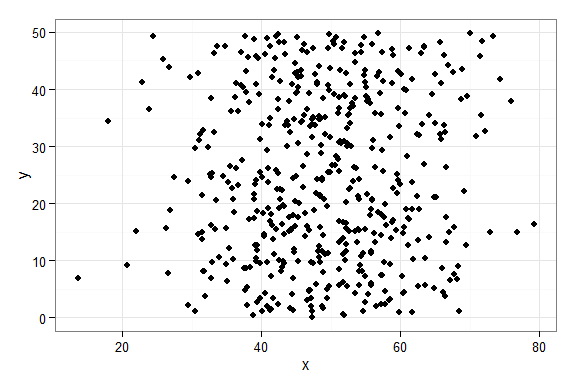
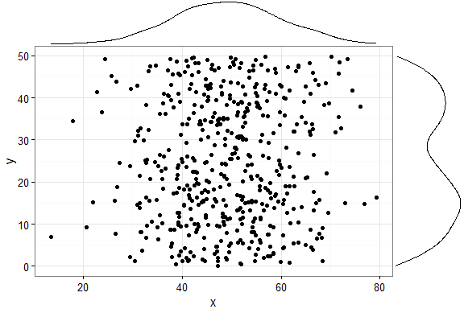
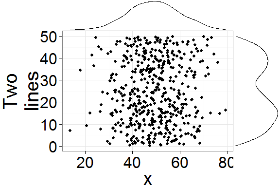
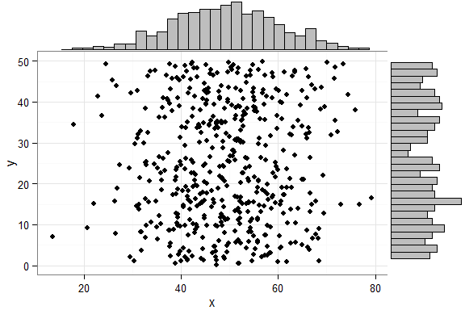
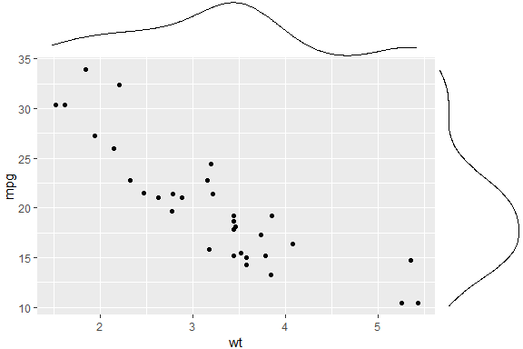
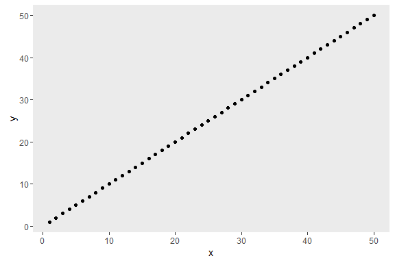
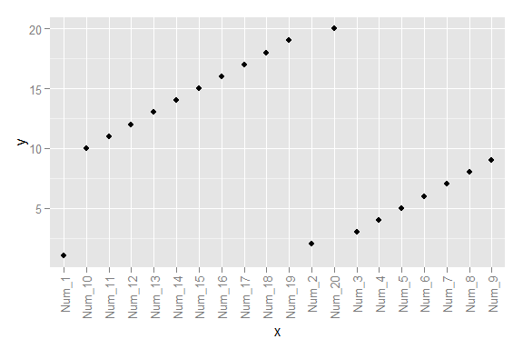
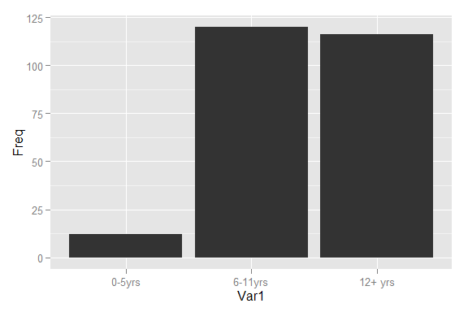

<!-- To create this README, I run devtools::build_vignettes(), then
rmarkdown::render("vignettes/overview.Rmd", output_format = "md_document"),
copy the contents of vignettes/overview.md here, replace all image paths
(overview_files to vignettes/overview_files),
and add the TravisCI status -->

ggExtra
=======

`ggExtra` is a collection of functions and layers to enhance ggplot2.

Most functions/layers are quite simple but are useful because they are
fairly common ggplot2 operations that are a bit verbose. After repeating
the same small bits of ggplot2 code dozens of times, I realized it was
time to package them :)

The `ggMarginal` function is more complex. After intensive Googling for
ways to add marginal density plots to ggplot2, I did find a few lengthy
StackOverflow posts, but every answer had messy code that was specific
for the dataset in question. I wasn't able to find a simple drop-in
function for adding marginal densities, so I created one.

Other functions include: `removeGrid` (and two variants), `rotateTextX`,
`plotCount`.

*Note: you might notice that there are no unit tests in this package. I
don't know of a good way to perform tests on plots, if you have a nice
simple solution please do let me know.*

Installation
------------

`ggExtra` is currently only available through GitHub and can be
downloaded easily using `devtools`.

    # install.packages("devtools")
    devtools::install_github("daattali/ggExtra")

Usage
-----

We'll first load the package and ggplot2, and then see how all the
functions work.

    suppressPackageStartupMessages({
      library("ggExtra")
      library("ggplot2")
    })

`ggMarginal` - Add marginal density/histogram to ggplot2 scatterplots
---------------------------------------------------------------------

You need to have the `grid` and `gridExtra` packages installed for this
function.

This function is meant to work as an easy drop-in solution for adding
marginal density plots of histograms to a ggplot2 scatterplot. You can
either pass it a ready ggplot2 scatterplot and it will add the marginal
plots, or you can just tell it what dataset and variables to use and it
will generate the scatterplot plus the marginal plots.

As a simple first example, let's create a dataset with 500 points where
the x values are normally distributed and the y values are uniformly
distributed, and plot a simple ggplot2 scatterplot.

    set.seed(30)
    df1 <- data.frame(x = rnorm(500, 50, 10), y = runif(500, 0, 50))
    (p1 <- ggplot(df1, aes(x, y)) + geom_point() + theme_bw())

Ok, now let's add marginal density plots.

    ggMarginal(p1)

That was easy. Notice how the syntax is not following the standard
ggplot2 syntax - you don't "add" a ggMarginal layer with
`p1 + ggMarginal()`, but rather ggMarginal takes the object as an
argument and returns a different object `ggMarginal(p1)`. This means
that you can use magrittr pipes, for example `p1 %>% ggMarginal`.

Let's make the text a bit larger to make it easier to see.

    ggMarginal(p1 + theme_bw(30) + ylab("Two\nlines"))

Notice how the marginal plots occupy the correct space, and even when
the main plot's points are pushed to the right because of larger text or
longer axis labels, the marginal plots automatically adjust.

You can also show histograms instead.

    ggMarginal(p1, type = "histogram")

There are several more parameters, here is an example with a few more
being used.

    ggMarginal(p1, margins = "x", size = 2, type = "histogram",
               marginCol = "blue", marginFill = "orange")

You don't have to supply a ggplot2 scatterplot, you can also just tell
ggMarginal what dataset and variables to use, but of course this way you
lose the ability to customize the main plot (change
text/font/theme/etc).

    ggMarginal(data = mtcars, x = "wt", y = "mpg")

`size = 2` means that the main scatterplot should occupy twice as much
height/width as the margin plots (default is 5).

For more information, see `?ggExtra::ggMarginal`.

`removeGrid` - Remove grid lines from ggplot2
---------------------------------------------

This is just a convenience function to save a bit of typing and
memorization. Minor grid lines are always removed, and the major x or y
grid lines can be removed as well (default is to remove both).

`removeGridX` is a shortcut for `removeGrid(x = TRUE, y = FALSE)`, and
`removeGridY` is similarly a shortcut for...
<leave as exercise for reader>.

    df2 <- data.frame(x = 1:50, y = 1:50)
    p2 <- ggplot2::ggplot(df2, ggplot2::aes(x, y)) + ggplot2::geom_point()
    p2 + removeGrid()

For more information, see `?ggExtra::removeGrid`.

`rotateTextX` - Rotate x axis labels
------------------------------------

Often times it is useful to rotate the x axis labels to be vertical if
there are too many labels and they overlap. This function accomplishes
that and ensures the labels are horizontally centered relative to the
tick line.

    df3 <- data.frame(x = paste("Num", 1:20, sep = "_"), y = 1:20)
    p3 <- ggplot2::ggplot(df3, ggplot2::aes(x, y)) + ggplot2::geom_point()
    p3 + rotateTextX()

For more information, see `?ggExtra::rotateTextX`.

`plotCount` - Plot count data with ggplot2
------------------------------------------

This is a convenience function to quickly plot a bar plot of count
(frequency) data. The input must be either a frequency table (obtained
with `base::table`) or a data.frame with 2 columns where the first
column contains the values and the second column contains the counts.

An example using a table:

    plotCount(table(infert$education))

An example using a data.frame:

    df4 <- data.frame("vehicle" = c("bicycle", "car", "unicycle", "Boeing747"),
                      "NumWheels" = c(2, 4, 1, 16))
    plotCount(df4) + removeGridX()

For more information, see `?ggExtra::plotCount`.