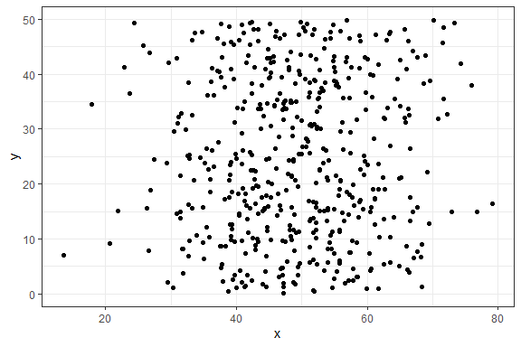
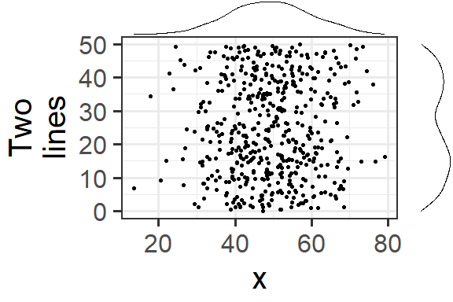
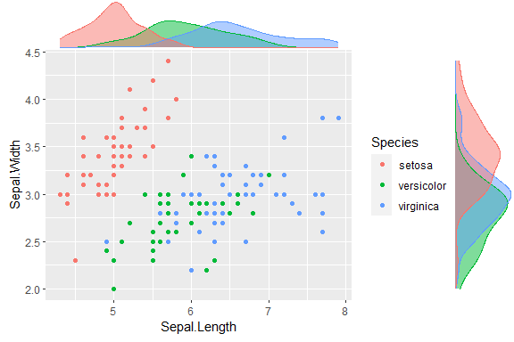
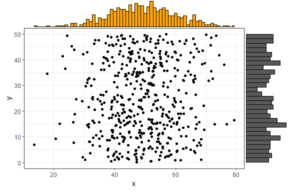

# ggExtra - Add marginal histograms to ggplot2, and more ggplot2 enhancements

[](https://cran.r-project.org/package=ggExtra)
[](https://github.com/daattali/ggExtra/actions/workflows/R-CMD-check.yaml)

> *Copyright 2016 [Dean Attali](https://deanattali.com). Licensed under
> the MIT license.*

`ggExtra` is a collection of functions and layers to enhance ggplot2.
The flagship function is `ggMarginal`, which can be used to add marginal
histograms/boxplots/density plots to ggplot2 scatterplots. You can view
a [live interactive
demo](https://daattali.com/shiny/ggExtra-ggMarginal-demo/) to test it
out!

Most other functions/layers are quite simple but are useful because they
are fairly common ggplot2 operations that are a bit verbose.

This is an instructional document, but I also wrote [a blog
post](https://deanattali.com/2015/03/29/ggExtra-r-package/) about the
reasoning behind and development of this package.

Note: it was brought to my attention that several years ago there was a
different package called `ggExtra`, by Baptiste (the author of
`gridExtra`). That old `ggExtra` package was deleted in 2011 (two years
before I even knew what R is!), and this package has nothing to do with
the old one.

## Installation

`ggExtra` is available through both CRAN and GitHub.

To install the CRAN version:

    install.packages("ggExtra")

To install the latest development version from GitHub:

    install.packages("devtools")
    devtools::install_github("daattali/ggExtra")

## Marginal plots RStudio addin/gadget

`ggExtra` comes with an addin for `ggMarginal()`, which lets you
interactively add marginal plots to a scatter plot. To use it, simply
highlight the code for a ggplot2 plot in your script, and select
*ggplot2 Marginal Plots* from the RStudio *Addins* menu. Alternatively,
you can call the addin directly by calling `ggMarginalGadget(plot)` with
a ggplot2 plot.


## Usage

We’ll first load the package and ggplot2, and then see how all the
functions work.

    library("ggExtra")
    library("ggplot2")

## `ggMarginal` - Add marginal histograms/boxplots/density plots to ggplot2 scatterplots

`ggMarginal()` is an easy drop-in solution for adding marginal density
plots/histograms/boxplots to a ggplot2 scatterplot. The easiest way to
use it is by simply passing it a ggplot2 scatter plot, and
`ggMarginal()` will add the marginal plots.

As a simple first example, let’s create a dataset with 500 points where
the x values are normally distributed and the y values are uniformly
distributed, and plot a simple ggplot2 scatterplot.

    set.seed(30)
    df1 <- data.frame(x = rnorm(500, 50, 10), y = runif(500, 0, 50))
    p1 <- ggplot(df1, aes(x, y)) + geom_point() + theme_bw()
    p1



And now to add marginal density plots:

    ggMarginal(p1)


That was easy. Notice how the syntax does not follow the standard
ggplot2 syntax - **you don’t “add” a ggMarginal layer with
`p1 + ggMarginal()`, but rather ggMarginal takes the object as an
argument** and returns a different object. This means that you can use
magrittr pipes, for example `p1 %>% ggMarginal()`.

Let’s make the text a bit larger to make it easier to see.

    ggMarginal(p1 + theme_bw(30) + ylab("Two\nlines"))



Notice how the marginal plots occupy the correct space; even when the
main plot’s points are pushed to the right because of larger text or
longer axis labels, the marginal plots automatically adjust.

If your scatterplot has a factor variable mapping to a colour (ie.
points in the scatterplot are colour-coded according to a variable in
the data, by using `aes(colour = ...)`), then you can use
`groupColour = TRUE` and/or `groupFill = TRUE` to reflect these
groupings in the marginal plots. The result is multiple marginal plots,
one for each colour group of points. Here’s an example using the iris
dataset.

    piris <- ggplot(iris, aes(Sepal.Length, Sepal.Width, colour = Species)) +
      geom_point()
    ggMarginal(piris, groupColour = TRUE, groupFill = TRUE)



You can also show histograms instead.

    ggMarginal(p1, type = "histogram")


There are several more parameters, here is an example with a few more
being used. Note that you can use any parameters that the `geom_XXX()`
layers accept, such as `col` and `fill`, and they will be passed to
these layers.

    ggMarginal(p1, margins = "x", size = 2, type = "histogram",
               col = "blue", fill = "orange")


In the above example, `size = 2` means that the main scatterplot should
occupy twice as much height/width as the margin plots (default is 5).
The `col` and `fill` parameters are simply passed to the ggplot layer
for both margin plots.

If you want to specify some parameter for only one of the marginal
plots, you can use the `xparams` or `yparams` parameters, like this:

    ggMarginal(p1, type = "histogram", xparams = list(binwidth = 1, fill = "orange"))



Last but not least - you can also save the output from `ggMarginal()`
and display it later. (This may sound trivial, but it was not an easy
problem to solve - [see this
discussion](https://stackoverflow.com/questions/29062766/store-output-from-gridextragrid-arrange-into-an-object)).

    p <- ggMarginal(p1)
    p


You can also create marginal box plots and violin plots. For more
information, see `?ggExtra::ggMarginal`.

#### Using `ggMarginal()` in R Notebooks or Rmarkdown

If you try including a `ggMarginal()` plot inside an R Notebook or
Rmarkdown code chunk, you’ll notice that the plot doesn’t get output. In
order to get a `ggMarginal()` to show up in an these contexts, you need
to save the ggMarginal plot as a variable in one code chunk, and
explicitly print it using the `grid` package in another chunk, like
this:

    ```{r}
    library(ggplot2)
    library(ggExtra)
    p <- ggplot(mtcars, aes(wt, mpg)) + geom_point()
    p <- ggMarginal(p)
    ```
    ```{r}
    grid::grid.newpage()
    grid::grid.draw(p)
    ```

## `removeGrid` - Remove grid lines from ggplot2

This is just a convenience function to save a bit of typing and
memorization. Minor grid lines are always removed, and the major x or y
grid lines can be removed as well (default is to remove both).

`removeGridX` is a shortcut for `removeGrid(x = TRUE, y = FALSE)`, and
`removeGridY` is similarly a shortcut for…
<leave as exercise for reader>.

    df2 <- data.frame(x = 1:50, y = 1:50)
    p2 <- ggplot2::ggplot(df2, ggplot2::aes(x, y)) + ggplot2::geom_point()
    p2 + removeGrid()


For more information, see `?ggExtra::removeGrid`.

## `rotateTextX` - Rotate x axis labels

Often times it is useful to rotate the x axis labels to be vertical if
there are too many labels and they overlap. This function accomplishes
that and ensures the labels are horizontally centered relative to the
tick line.

    df3 <- data.frame(x = paste("Letter", LETTERS, sep = "_"),
                      y = seq_along(LETTERS))
    p3 <- ggplot2::ggplot(df3, ggplot2::aes(x, y)) + ggplot2::geom_point()
    p3 + rotateTextX()


For more information, see `?ggExtra::rotateTextX`.

## `plotCount` - Plot count data with ggplot2

This is a convenience function to quickly plot a bar plot of count
(frequency) data. The input must be either a frequency table (obtained
with `base::table`) or a data.frame with 2 columns where the first
column contains the values and the second column contains the counts.

An example using a table:

    plotCount(table(infert$education))


An example using a data.frame:

    df4 <- data.frame("vehicle" = c("bicycle", "car", "unicycle", "Boeing747"),
                      "NumWheels" = c(2, 4, 1, 16))
    plotCount(df4) + removeGridX()


For more information, see `?ggExtra::plotCount`.

## Testing `ggMarginal()`

When running `devtools::test()` to test the package, visual tests (creating a plot and automatically inspecting it against an expected plot) will not get run by default. Visual tests only get run if the `RunVisualTests` envvar is set to `"yes"`. Because different operating systems and environments can produce slightly different plots, running the visual tests may result in many failures even if the plots seem identical to the naked eye. For this reason, we test the visual tests inside a docker container that can provide a reproducible environment. This docker container explicitly installs fixed versions of packages that can affect the visuals, and it can install any version of {ggplot2} so that you can run the tests against different {ggplot2} versions.

To run the tests, first build the container:

    docker build -t ggextra-test --build-arg GGPLOT2_VERSION=3.5.0 .
    
You can provide any {ggplot2} version, or you can omit the build argument entirely to use the latest CRAN version. Then run the container in order to run the tests:

    docker run --rm ggextra-test

If you added new `ggMarginal()` plot tests (in [`tests/testthat/helper-funs.R`](tests/testthat/helper-funs.R)), you will need to generate the expected plot because there is nothing to test against yet. Run the same `docker build` command, but add an argument to the `run` command that will mount the container's folder onto your file system, so that the snapshots will get saved on your computer.

    docker run --rm -v "$(pwd):/pkg" ggextra-test

When adding a new test, make sure to build and run docker containers for each of the {ggplot2} versions that are being tested in [the GitHub Action workflow](.github/workflows/test-ggplot2-versions.yml).
